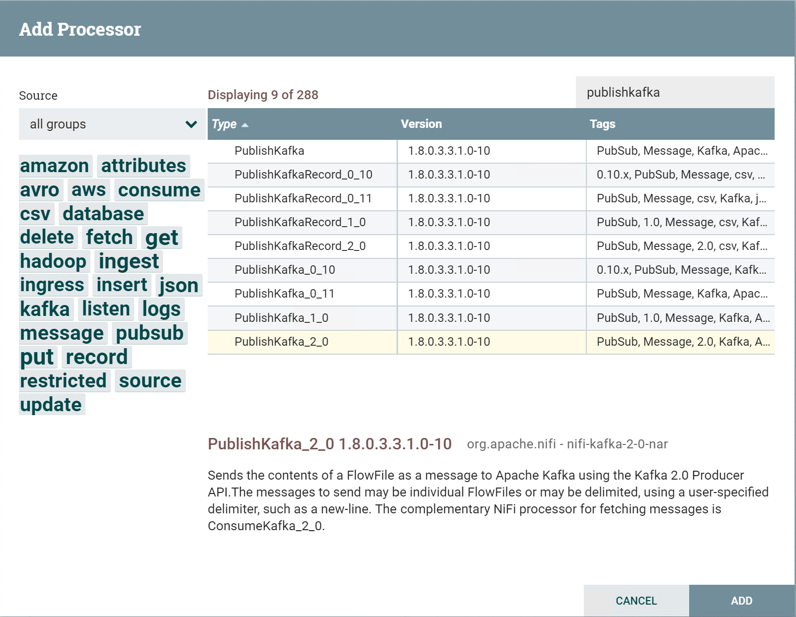
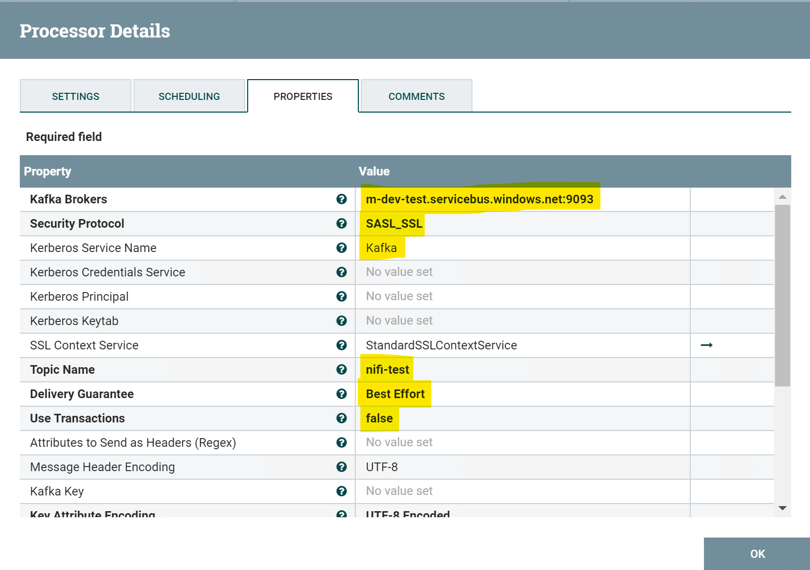
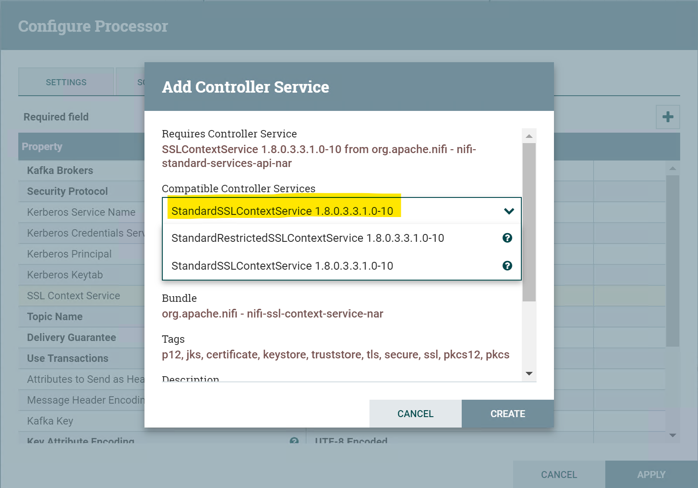
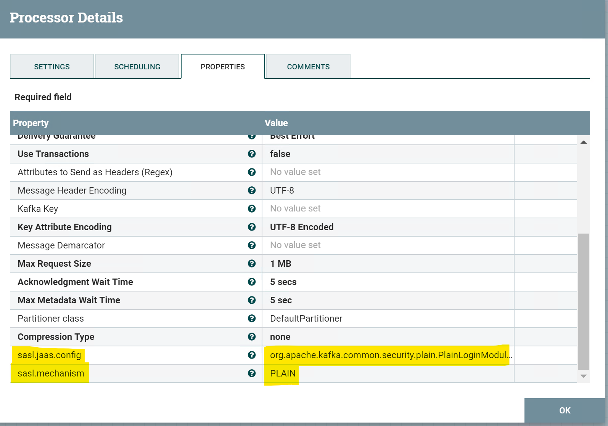

# Using Apache NiFi with Event Hubs for Apache Kafka Ecosystems

This tutorial will show how to connect Apache NiFi to Kafka-enabled Event Hubs without changing your protocol clients or running your own clusters. Azure Event Hubs for Apache Kafka Ecosystems supports [Apache Kafka version 1.0](https://kafka.apache.org/10/documentation.html) and later.

## Prerequisites

If you don't have an Azure subscription, create a [free account](https://azure.microsoft.com/en-us/free/?ref=microsoft.com&utm_source=microsoft.com&utm_medium=docs&utm_campaign=visualstudio) before you begin.

In addition:

* [Java Development Kit (JDK) 1.7+](http://www.oracle.com/technetwork/java/javase/downloads/index.html)
    * On Ubuntu, run `apt-get install default-jdk` to install the JDK.
    * Be sure to set the JAVA_HOME environment variable to point to the folder where the JDK is installed.
* [Download](http://maven.apache.org/download.cgi) and [install](http://maven.apache.org/install.html) a Maven binary archive
    * On Ubuntu, you can run `apt-get install maven` to install Maven.
* [Git](https://www.git-scm.com/downloads)
    * On Ubuntu, you can run `sudo apt-get install git` to install Git.
* [NiFi cluster](https://azuremarketplace.microsoft.com/en-us/marketplace/apps/onyx-point-inc.op-bnf1_6-v1?src=spart&tab=Overview) setup with Kerberos

## Create an Event Hubs namespace

An Event Hubs namespace is required to send or receive from any Event Hubs service. See [Create Kafka-enabled Event Hubs](https://docs.microsoft.com/azure/event-hubs/event-hubs-create-kafka-enabled) for instructions on getting an Event Hubs Kafka endpoint. Make sure to copy the Event Hubs connection string for later use.

### FQDN

For these samples, you will need the connection string from the portal as well as the FQDN that points to your Event Hub namespace. **The FQDN can be found within your connection string as follows**:

`Endpoint=sb://`**`mynamespace.servicebus.windows.net`**`/;SharedAccessKeyName=XXXXXX;SharedAccessKey=XXXXXX`

If your Event Hubs namespace is deployed on a non-Public cloud, your domain name may differ (e.g. \*.servicebus.chinacloudapi.cn, \*.servicebus.usgovcloudapi.net, or \*.servicebus.cloudapi.de).

## Using the NiFi Kafka Publish Processor

Once the NiFi web interface is up and running, select the right Kafka processor.

**Note: Event Hub supports Kafka protocol 1.0 and above. So make sure you select the right processor**

### Configuring Kafka Processor for NiFi

Update the configuration properties of the processor using below information:

*The screen shots used are of the NiFi Kafka PublishKafka_2_0 1.8.0.3.3.1.0-10 processor*

* `Kafka brokers` field with the Event Hub FQDN obtained earlier followed by Port 9093. Eg. `mynamespace.servicebus.windows.net:9093`

* Select `SASL_SSL` from drop down for `Security protocol` options

* `Kerberos Service Name` as `Kafka`

* `Topic Name` would be the name of the Event Hub

* Let `Delivery Gaurantee` be `Best Effort` and set `Use Transactions` value to `false`

* Configuring SSL Context Service:

    The context service needs to be configured with a valid certstore that can be used to validate the endpoint that will be used to connect to Event Hubs.

    * Select option to Create new service in the SSL Context Service dropdown options

    * Add new `StandardSSLControllerService` from the dropdown on next menu

    

    * Once created, hit the arrow to open the configuration and settings for the `StandardSSLControllerService` just created

    

    * Configure the StandardSSLControllerService with below properties:

        * `Trustore Filename` => the cacerts from your Java installation
        
            If $JAVA_HOME Is set on your system, it should help point you in the right direction. If not, the location of cacerts varies depending on environment, but is approximately the following for their respective OS

            * **OS X**: /Library/Java/JavaVirtualMachines/jdk<version>.jdk/Contents/Home/jre/lib/security/cacerts
            * **Windows**: C:\Program Files\Java\jdk<version>\jre\lib\security\cacerts
            * **Linux**: /usr/lib/jvm/java-<version>/jre/lib/security/cacerts -- You can additionally use $(readlink -f $(which java))

        * `Truststore Type` => `JKS`

        * `Truststore Password` => The default password is "`changeit`" if you are using the default keystore

    * Save the `StandardSSLControllerService` configuration just created.
    This might show you a message saying "Validating" for some time. If it does that, close the current NiFi flow configuration window and reopen it.

    

    * You may find that the `StandardSSLControllerService` is `Disabled`. Click the highlighted icon on the right to `Enable` it.

    

* Using the `+` symbol to add custom properties, add in the following additional custom properties with the values as follows:

    * `sasl.jaas.config` with value => `org.apache.kafka.common.security.plain.PlainLoginModule required username="$ConnectionString" password="{YOUR.EVENTHUBS.CONNECTION.STRING}";`

    * `sasl.mechanism` with value => `PLAIN`

## Using NiFi to create data flow with Event Hubs

The configuration for the ConsumeKafka processor in NiFi will be similar.

With the above configurations, you should be all set to create your own data flow using Event Hubs with Kafka protocol.